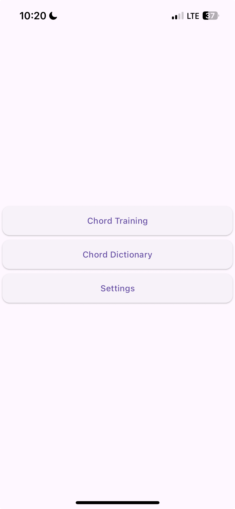
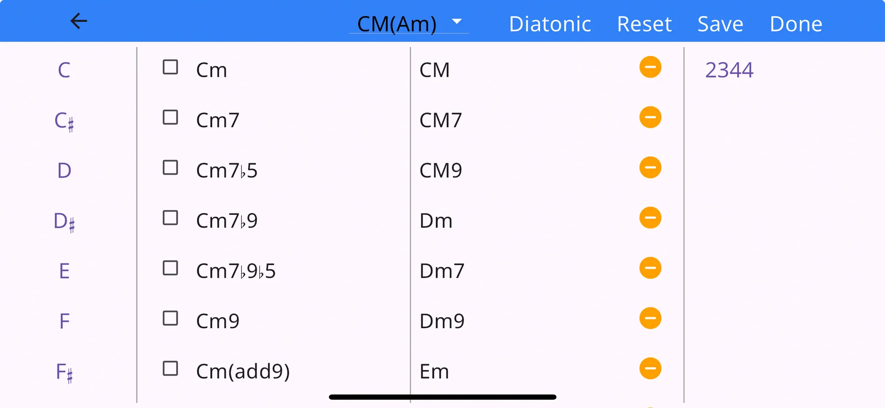
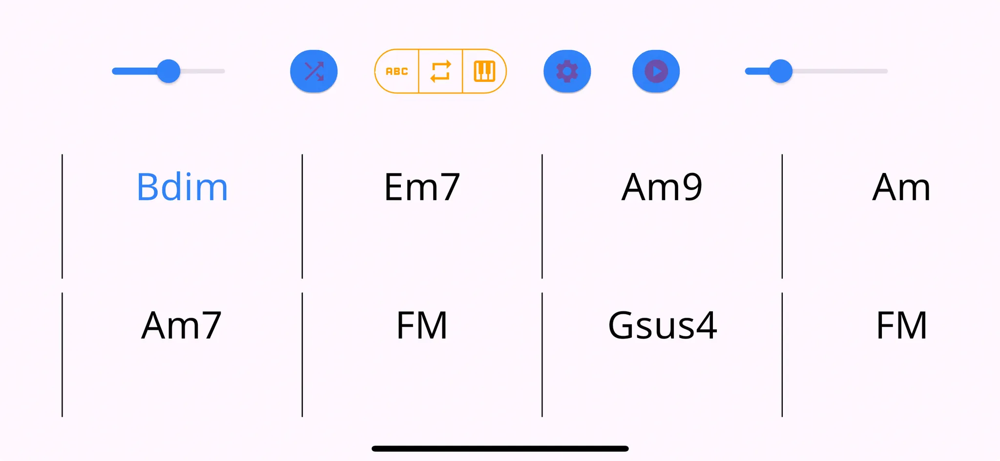
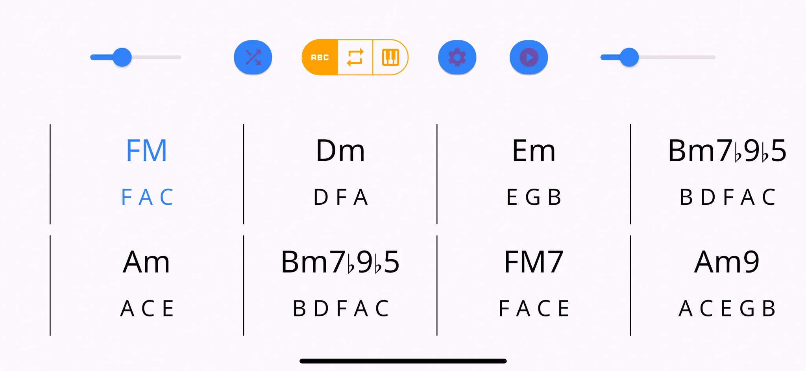
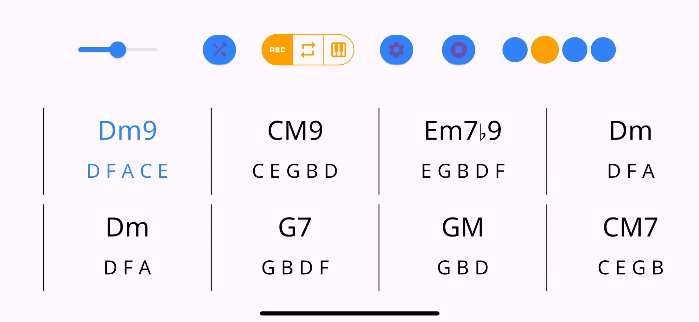
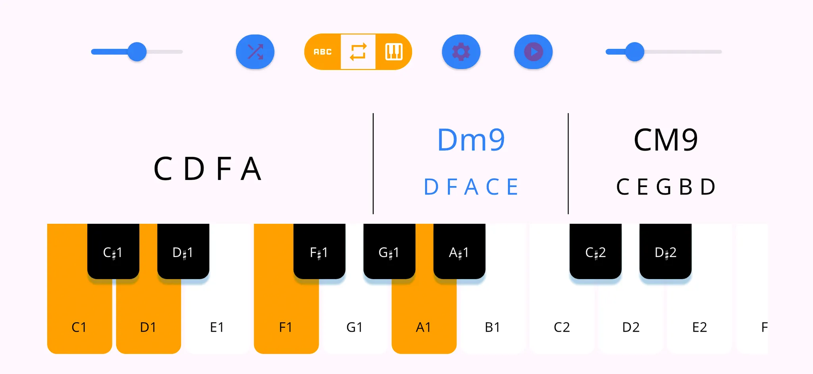
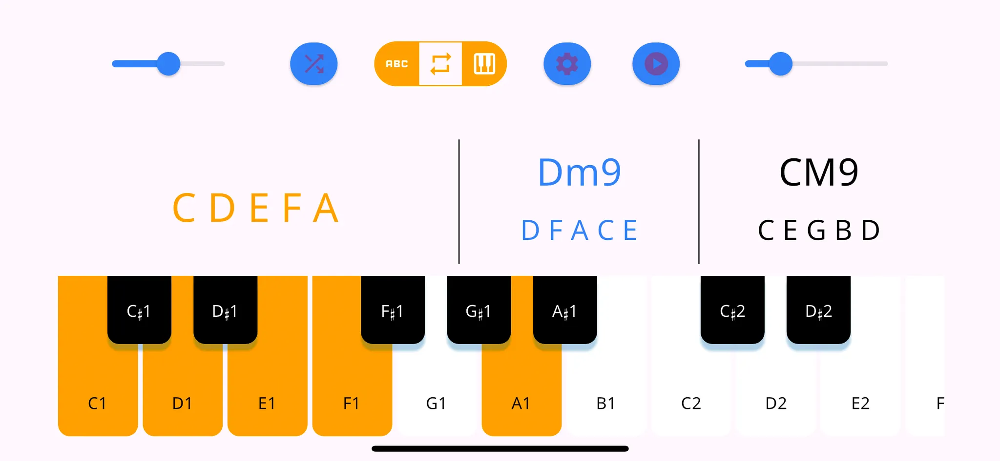
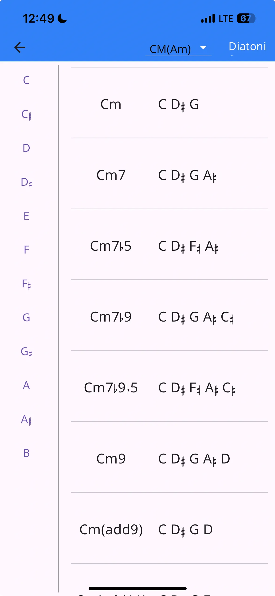
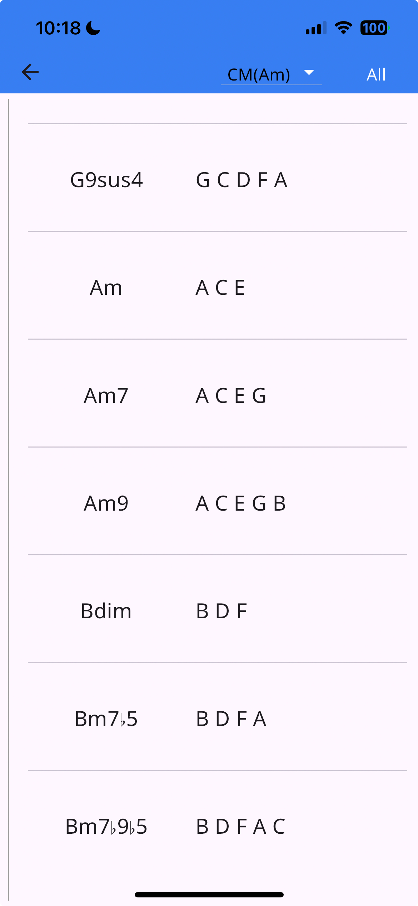

# C2B (C to B) ♫⋆｡♪₊˚
피아노, 통기타 등의 악기를 위한 코드 연습 앱입니다. 코드를 무작위로 띄워주어 코드 연주 순발력을 키울 수 있습니다. 특히 코드 초견 시험을 준비하는 실용음악 입시생들에게 도움이 될 것입니다. 기본적인 3화음 코드부터 텐션 코드까지 다양한 코드가 준비돼 있습니다. 무작위 코드 진행 연습을 시작하기 전에 연습에 포함시키기 원하는 코드를 직접 선택하시고 원하는 난이도로 연습하세요. 피아노가 없는 환경에서도 간이로 연습할 수 있도록 가상건반 연습모드도 준비했습니다.

# Table of Contents

- [📱 Screens](#📱-screens)
  - [1. 홈 화면](#1-홈-화면)
  - [2. 코드 선택 화면](#2-코드-선택-화면)
  - [3. 코드 연습 화면](#3-코드-연습-화면)
    - [기본 모드](#기본-모드)
    - [가상피아노 연습 모드](#가상피아노-연습-모드)
  - [4. 코드 사전 화면](#4-코드-사전-화면)
  - [5. 설정 화면](#5-설정-화면)

> 개발, 기획 관련 자료는 ```docs/```에 있습니다.

# 📱 Screens

## 1. 홈 화면

홈 화면. 앱 실행시 처음으로 나타나는 화면



## 2. 코드 선택 화면

연습하기 원하는 코드를 선택하여 코드 모음을 만드는 화면. 연습 화면으로 넘어가면 코드 모음 내에서 코드를 랜덤으로 뽑아 차례로 띄워줌.



- 앱바 섹션
    - `←`: 홈 화면으로 가기
    - `CM(Am) 드롭다운`: Key 선택
    - `Diatonic`: 현재 선택된 key에 대한 diatonic 코드들 선택하기
    - `Reset`: 코드 선택 모두 클리어
    - `Save`: 현재 선택된 코드들 프리셋으로 저장하기
- 코드 선택 섹션
    - Root 선택하기 - 해당 음을 근음으로 갖는 코드만 보여줌
    - 코드 선택
    - 선택된 코드 안선택으로 변경
    - 프리셋(저장된 코드 풀) 불러오기

> \- orientation: landscape 모드 강제<br> \- 코드를 한개 이상 선택해야만 코드 연습 페이지로 넘어갈 수 있음

## 3. 코드 연습 화면

코드 선택 화면에서 선택한 코드들 중에서 일정 수의 코드를 랜덤으로 뽑아 보여줌. 

### 기본 모드

두 마디의 랜덤 코드를 보여준다. 현재 연습해야하는 코드를 파란색으로 표시한다. 연습을 시작하면 메트로놈 4박이 지날 때마다 코드가 넘어간다. 

대기 상태


대기 상태 - 코드 구성음 표시 ON


연습중 상태


**악보 섹션 (랜덤 코드 나열)**

- 한 마디(bar)에 코드 한개
- 한 줄(phrase)에 4마디씩 2줄(윗줄, 아랫줄), 총 8마디
- 한 phrase 지날 때마다 새로운 phrase(랜덤 코드 4개) 생성하고 한 줄씩 위로 밀려올라감.
- 현재 진행중인 코드를 파란색으로 표시

**상단 컨트롤**

- 볼륨 바: 메트로놈 볼륨 조절
- 셔플 버튼: 코드 풀로부터 현재 화면에 띄울 코드 8개 다시 뽑기
- 토글 버튼 3개
    - 코드 구성음 표시 ON/OFF
    - 현재 phrase 반복 연습 ON/OFF
    - 기본 모드/가상피아노 모드 전환
- 설정 버튼: 코드 모음 선택화면으로 가기
- 연습 Start/Stop 버튼
- BPM 조절 바: 메트로놈 BPM(연습 코드 넘어가는 속도) 조절.
- 박자 인디케이터: 메트로놈의 움직임 표시

### 가상피아노 연습 모드

대기 상태 - 가상건반 모드


대기 상태 - 가상건반 모드 - 정답 맞춘 상태


- 각 건반은 한번 터치하여 선택/미선택 상태로 만들 수 있음.
- 코드는 두개씩만 보여줌
- 왼쪽에는 선택된 건반의 음을 띄움
- 선택된 건반의 음들이 현재 연습중인 코드의 구성음과 동일하면 연두색으로 표시
- 메트로놈이 4박이 지나면 다음코드로 넘어가고 모든 건반은 미선택으로 바뀜 

## 4. 코드 사전 화면

코드 이름과 해당 코드의 구성음을 보여줌.


 

- `CM(Am) 드롭다운`: Key 선택
- `Diatonic`: 현재 선택된 key에 대한 diatonic 코드만 보여주기

## 5. 설정 화면
각종 앱 정보와 앱 설정이 들어가는 페이지


- 사용자가 만든 코드 모음 preset을 모두 삭제하는 기능