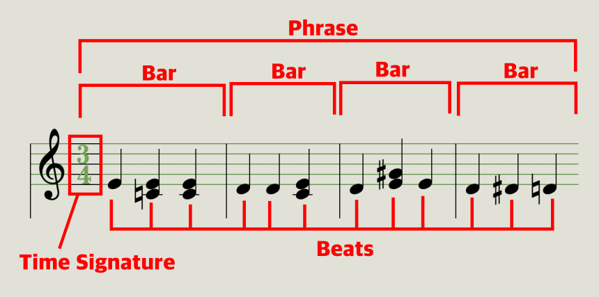
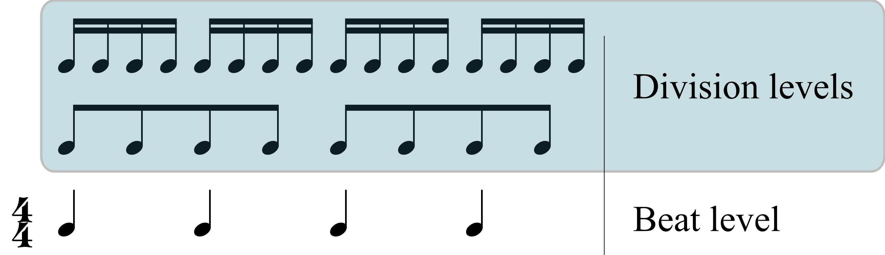

# Terms

개발에 쓰인 음악 관련 개념 및 용어

# Table of Contents

- [1. 메트로놈, 악보](#1-메트로놈-악보)
  - [Time signature](#time-signature)
  - [Beat](#beat)
  - [Bar](#bar)
  - [Division](#division)
  - [BPM](#bpm)
- [2. Semitone 표기](#2-semitone-표기)
- [3. Key, scale, pitch](#3-key-scale-pitch)
  - [Key](#key)
  - [Scale](#scale)
  - [Pitch](#pitch)
- [4. Chord 구조](#4-chord-구조)
  - [Root](#root)
  - [Quality](#division)

## 1. 메트로놈, 악보

### Time signature

박자표. "meter signature", "measure signature"로도 부름. 아래(3/4)의 경우, "4분음 3박자"로 읽음. "4분음"은 한 박의 상대적 길이, "3박"은 한마디에 들어가는 박의 개수.

"4분음 3박자" 악보는 4분음표 3개가 한 마디를 구성.

### Beat

박자표의 박.

### Bar

악보의 한 마디. 박자표가 <4분음 2박자>라면 4분음 길이의 beat 2개가 한 마디를 이룸.

[출처: https://en.wikipedia.org/wiki/Beat_(music)]

### Division

Beat를 더 작게 분할한 단위.

### BPM

Beat Per Minute. 한 박의 길이 단위. 110BPM인 경우 한 박의 길이는 60초 / 110 = 0.545초

## 2. Semitone 표기

반음(semitone) 간격을 1로 정의. root를 기준으로 root 위 음들을 정수로 표현.

- 근음(root): 0
- 반음 위 음: 1
- 온음 위 음: 2
- 한 옥타브 위 음: 12
- 한 옥타브 하고도 반음 위 음: 13

> 10음, 11음 12음, 13음, ... 은 X, N, 1, 2, ... 로 표기할 수도 있다.

## 3. Key, scale, pitch

### Key

key signature: 조표. ♯, ♭, ♮의 집합.

- D Key: 파, 도에 ♯ 붙음
- Bb Key: 시, 미에 ♭ 붙음

### Scale

계. 한 음을 기준으로 한 옥타브 위의 음까지 음을 쌓아올리는 규칙으로 이루어짐. 계이름은 계에서 사용되는 이름. 계의 기준이 되는 음이 C.

### Pitch

음. 음이름은 계에 상관없이 소리의 높이에 따라 붙여지는 절대적인 이름.

## 4. Chord 구조

root와 quality로 정의.

### Root

root note, 근음. 코드의 가장 낮은 음. CMaj7 코드의 root는 C. 

### Quality

"A set of intervals between the root and the others"

화성. root로부터 코드의 구성음, 화음을 쌓아올리는 규칙. CMaj7 코드의 quality는 'Maj7'. 각 quality는 코드 구성음을 [semitone 표기](#2-semitone-표기)로 나열하는 방식으로 나타낼 수 있다.

- Maj7: 0, 4, 7, 11 (Or 047N)
- min9: 0, 3, 7, 10, 14 (Or 037X2)
- dim9: 0, 3, 6, 9, 14 (Or 03692)